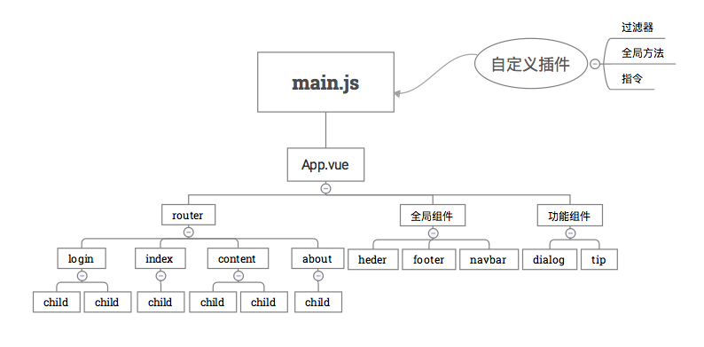

main.js是入口文件，主要作用是初始化vue实例并使用需要的插件


import Vue from 'vue'
import App from './App'
import VueRouter from 'vue-router'
import VueResource from 'vue-resource'
import filter from './filter'
import store from './vuex/store'
import { sync } from 'vuex-router-sync'
import { configRouter } from './config_router'
import resourceGlobalSet from './resource_set'
 
Vue.use(VueResource)
Vue.use(VueRouter)
// 初始化自定义过滤器
Vue.use(filter)
 
const router = new VueRouter({
history: true,
saveScrollPosition: true
})
configRouter(router)
Vue.http.options.emulateJSON = true
Vue.http.interceptors.push(resourceGlobalSet) // ajax 拦截
 
sync(store, router)
router.start(App, 'app')

如同上面所示，主要是使用和配置相应插件，并初始化一个vue，上面的初始化在router.start(App,'app'),是以App.vue为主要组件，并以html中的为挂载替换点