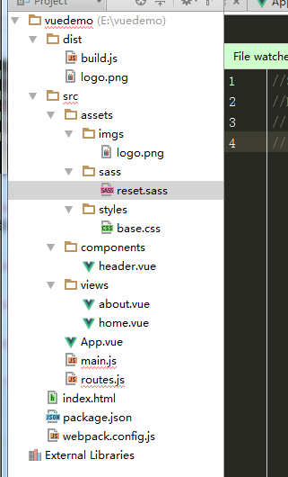

main.js是入口文件，主要作用是初始化vue实例并使用需要的插件


import Vue from 'vue'
import App from './App'
import VueRouter from 'vue-router'
import VueResource from 'vue-resource'
import filter from './filter'
import store from './vuex/store'
import { sync } from 'vuex-router-sync'
import { configRouter } from './config_router'
import resourceGlobalSet from './resource_set'
 
Vue.use(VueResource)
Vue.use(VueRouter)
// 初始化自定义过滤器
Vue.use(filter)
 
const router = new VueRouter({
history: true,
saveScrollPosition: true
})
configRouter(router)
Vue.http.options.emulateJSON = true
Vue.http.interceptors.push(resourceGlobalSet) // ajax 拦截
 
sync(store, router)
router.start(App, 'app')

如同上面所示，主要是使用和配置相应插件，并初始化一个vue，上面的初始化在router.start(App,'app'),是以App.vue为主要组件，并以html中的为挂载替换点

### webpack +vue+vueRouter模块化构建完整项目实例

1.新建项目文件名为vuedemo
2.npm init -y 初始化项目

安装项目依赖
3. npm install --save vue  //默认安装最新版vue
4. npm install --save-dev webpack webpack-dev-server //是一个小型的node.js Express服务器
5. npm install --save-dev babel-core babel-loader babel-preset-es2015 //安装babel,babel的作用是将es6的语法编译成浏览器认识的语法es5

6. npm install --save-dev vue-loader vue-template-compiler  //用来解析vue的组件，vue后缀的文件
7. npm install --save-dev css-loader style-loader  //用来解析css

拓展：css-loader 和 style-loader，二者处理的任务不同，css-loader使你能够使用类似@import 和 url(…)的方法实现 require()的功能,style-loader将所有的计算后的样式加入页面中，二者组合在一起使你能够把样式表嵌入webpack打包后的JS文件中。

8. npm install --save-dev url-loader file-loader // 用于打包文件和图片
9. npm install --save-dev sass-loader node-sass  //用于编译sass
10. npm install --save-dev vue-router  //安装路由


### 编辑项目目录以及添加代码
11.文件目录如下;

//dist文件是后面执行webpack指令生产的，不用管；

//webpack.config.js 配置文件，本身也是一个标准的Commonjs规范的模块；

//routes.js文件放路由配置文件；

//index.html首页入口文件

//App.vue是项目入口文件。

//main.js这是项目的核心文件。全局的配置都在这个文件里面配置。

//commponents目录里面放了公共组件header文件。

//views文件放详情页面；

#### 代码 webpack.config.js
*注释：
test：一个匹配loaders所处理的文件的扩展名的正则表达式（必须）
loader:loader的名称(必须)
include/exclude:手动添加必须处理的文件或屏蔽不需要处理的文件

var path = require('path')
var webpack = require('webpack')

module.exports = {
    entry: './src/main.js',  //值可以是字符串、数组或对象
    output: {
        path:path.resolve(_dirname,'./dist'),  //webpack结果存储
        publicPath: '/dist/',
        filename: 'build.js'
    },
    module: {
        rules: [
            {
                test:/\.vue&/,
                loader: 'vue-loader',
                options: {
                    loaders: {

                    }
                    // other vue-loader options go here
                }
            },
            {
                test:/\.js$/,
                loader: 'babel-loader',
                exclude: /node_modules/
            },
            {
                test:/\.(png|jpg|gif|svg)$/,
                loader: 'file-loader',
                options: {
                    name: '[name].[ext]?[hash]'
                }
            },
            //自己加的
            {
                test:/\.css$/,
                loader: 'style-loader!css-loader'
            },
            {
                test: /\.scss&/,
                loader: 'style-loader!css-loader!sass-loader!'
            }
        ]
    },
    resolve: {
        alias: {
            'vue$': 'vue/dist/vue.esm.js'
        }
    },
    devServer: {    //webpack-dev-server配置
        historyApiFallback: true, //不跳转
        noInfo: true,
        inline: true //实时刷新
    },
    performance: {
        hints: false
    },
    devtool: '#eval-source-map'
}

if (process.env.NODE_ENV === 'production') {
    module.exports.devtool = '#source-map'
    // http://vue-loader.vuejs.org/en/workflow/production.html
    module.exports.plugins = (module.exports.plugins || []).concat([
        new webpack.DefinePlugin({
            'process.env': {
                NODE_ENV: '"production"'
            }
        }),
        new webpack.optimize.UglifyJsPlugin({
            sourceMap: true,
            compress: {
                warnings: false
            }
        }),
        new webpack.LoaderOptionsPlugin({
            minimize: true
        })
    ])
}


#### router.js

// 引用模板
import Vue from 'vue';
import Router from 'vue-router';
import indexPage from './components/header.vue'
import homePage from './views/home.vue'
import aboutPage from './views/about.vue'

Vue.use(Router)

export default new Router({
    routes:[
        {
            path:'/',
            component:homePage
        },
        {
            path:'/about',
            component:aboutPage
        }
    ]
})


#### index.html

<!DOCTYPE html>
<html lang="en">
<head>
    <meta charset="UTF-8">
    <title>Title</title>
</head>
<body>
    

    

    
</body>
</html>


#### App.vue

<!--App.vue是项目入口文件。-->
<template>
    

        <header-tab></header-tab>
        <h2>{{msg}}</h2>
        

            

                <router-link class="nav-item" to="/">首页</router-link>
                <router-link class="nav-item" to="/about">关于</router-link>
            

        

        

            <router-view></router-view>
        

    

</template>



#### main.js

//main.js这是项目的核心文件。全局的配置都在这个文件里面配置
import Vue from 'vue'
import App from './App.vue'
import router from './routes.js'

import './assets/styles/base.css'
//import './assets/sass/reset.sass'//报错暂时不用sass
Vue.config.debug = true;//开启错误提示

new Vue({
        router,
        el: '#appIndex',
        render: h => h(App)
})


#### commponents/ header.vue


<template>
    

        <h1>共同header</h1>
        
    

</template>


#### views文件放详情页面；
about.vue

//about.vue
<template>
    
about

</template>


home.vue

//index.vue
<template>
    

        <ol>
            <li v-for="todo in todos">
                {{ todo.text }}
            </li>
        </ol>
        <button @click="eClick()">事件</button>
    

</template>



#### base.css

h1{
    color: #999;
}


#### reset.sass(这个屏蔽起来先。有报错、、)

//$redColor:#f00;
//h2{
//  color:$redColor;
//}


### 项目跑起来

执行命令

npm install cross-env --save-dev

packpage.json文件添加：
"dev": "cross-env NODE_ENV=development webpack-dev-server --open --hot",
"build": "webpack"

执行 npm run dev

执行 npm run build （相当于把npm的build指令指向webpack命令）
